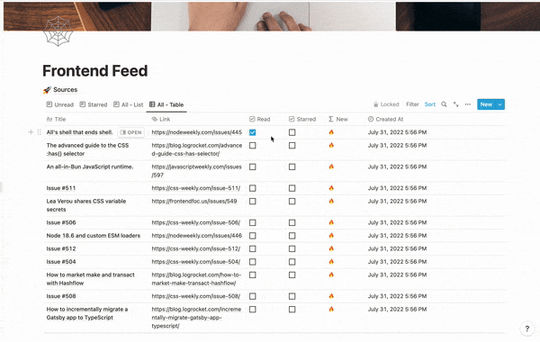
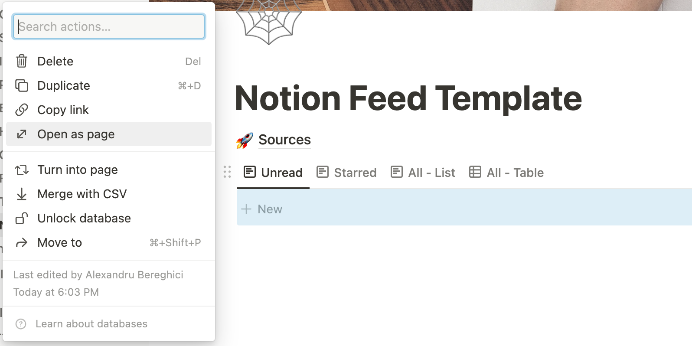

# Notion Feed

A Rust app for creating RSS Feeds in [Notion](https://notion.so).



---

## Features

- Manage your RSS sources in a separate Notion page
- Enable/disable RSS sources
- Read feed with different views ( unread, starred, as list, as table)

## Setup

1. Create a new [Notion Integration](https://www.notion.so/my-integrations) and
   copy the secret code which we'll use as `NOTION_API_TOKEN` later.
2. Duplicate the
   [template](https://www.notion.so/abereghici/Notion-Feed-Template-c5eec347363e4bcb880bfbc6b9030c79)
   to your Notion.
3. Open the template and click _Share > Invite_ and search the Notion
   integration you created in Step 1 and Click **Invite**.
4. Click on _Sources_ page and do the same actions as in the previous step.
5. Fork this repository, then go to your forked GitHub repository and enable the
   GitHub Actions by visiting the **Actions** tab and click "I understand my
   workflows, enable them".
6. Click on the **Get Feed** action in the left panel and then click "Enable
   workflow".
7. Go to _Settings > Secrets_. Add the following three secrets along with their
   values as **Repository secrets**.
   ```
   NOTION_API_TOKEN
   NOTION_SOURCE_DATABASE_ID
   NOTION_FEED_DATABASE_ID
   ```
   > To find the source database ID, open the Sources page. You'll get a URL
   > like this: https://www.notion.so/{database_id}?v={view_id}. To find the
   > feed database ID, open the main page of the template. Highlight the table
   > and click on "dots" button and select _Open as page_ option. Copy the
   > database ID from the URL in the same way you did for the source database
   > ID. Example:

The application accepts the source database ID and feed database ID as
parameters. This can be useful if you want to configure multiple RSS feeds in
**Get Feed** action [here](.github/workflows/main.yml#L20). Example:

```
cargo run --notion-source-database-id=... --notion-feed-database-id=...
```

The feed will be updated daily at 12:30 UTC. If you want to change the time, you
can change the cron job [here](.github/workflows/main.yml#L5)
